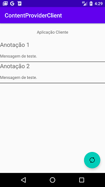

# Content Provider Client
Projeto desenvolvido no curso "Desenvolvimento integrado de aplicações Android" no bootcamp everis Kotlin Developer da [Digital Innovation One](https://digitalinnovation.one).

Este aplicativo é um cliente do Content Provider criado no projeto [NotesContentProvider](https://github.com/madsoncoelho/NotesContentProvider). Ele permite visualizar as notas inseridas no NotesContentProvider.

## Instruções

Em primeiro lugar, faça o clone ou download do repositório [NotesContentProvider](https://github.com/madsoncoelho/NotesContentProvider). Execute o aplicativo no Android Studio e insira algumas notas.

Em seguida, faça o clone ou download do repositório atual e execute o aplicativo no Android Studio. Ele fará a leitura e exibirá as notas do Content Provider.

## Screenshots
